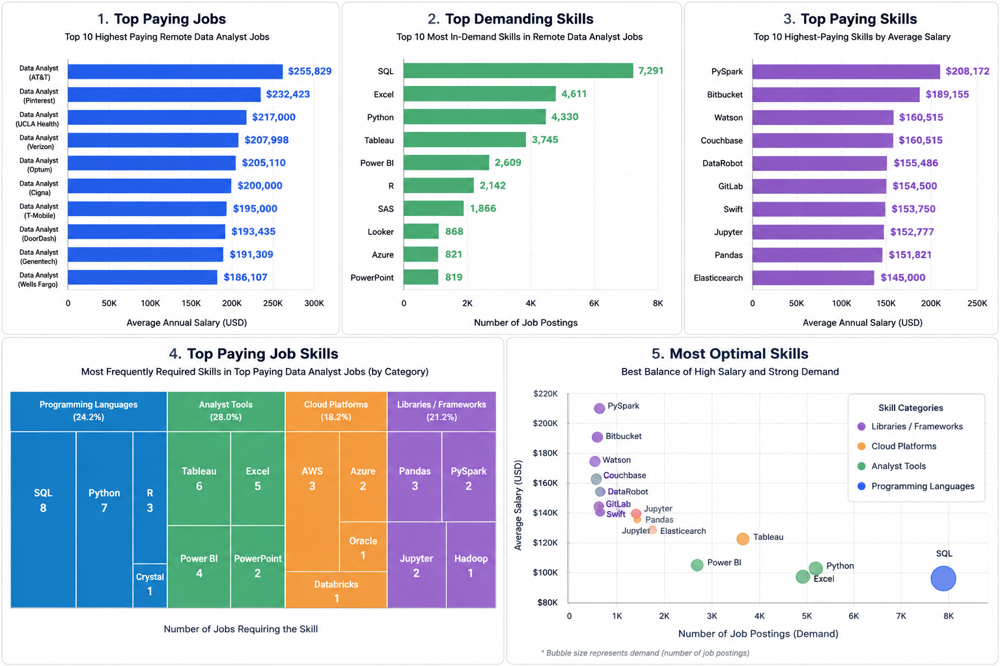

# SQL Learning Project

A collection of SQL analyses performed on a real-world Data Analyst job postings dataset. This project explores salary trends, market demand, and the skills that provide the highest career value using PostgreSQL.

---

## Dashboard

<p align="center">
  
</p>

---

# Project Overview

This project answers five important business questions:

1. Which remote Data Analyst jobs offer the highest salaries?
2. Which skills are most frequently requested by employers?
3. Which technical skills command the highest salaries?
4. Which skills are required in the highest-paying jobs?
5. Which skills offer the best balance of salary and demand?

---

# Queries

| Analysis | Description | SQL File |
|----------|-------------|----------|
| 💰 Top Paying Jobs | Finds the highest-paying remote Data Analyst positions. | [top_paying_jobs.sql](https://github.com/Pai05/sql_learning/blob/main/project_sql/top_paying_jobs.sql) |
| 🛠 Top Paying Job Skills | Identifies the skills required by the highest-paying jobs. | [top_paying_job_skills.sql](https://github.com/Pai05/sql_learning/blob/main/project_sql/top_paying_job_skills.sql) |
| 📈 Top Demanding Skills | Determines the skills most frequently requested in job postings. | [top_demanding_skills.sql](https://github.com/Pai05/sql_learning/blob/main/project_sql/top_demanding_skills.sql) |
| 💵 Top Paying Skills | Calculates the highest-paying technical skills based on average salary. | [top_paying_skills.sql](https://github.com/Pai05/sql_learning/blob/main/project_sql/top_paying_skills.sql) |
| ⭐ Most Optimal Skills | Combines salary and demand to identify the most valuable skills to learn. | [most_optimal_skill.sql](https://github.com/Pai05/sql_learning/blob/main/project_sql/most_optimal_skill.sql) |

---

# Dashboard Highlights

### 💰 Top Paying Jobs

- Identifies the ten highest-paying remote Data Analyst roles.
- Filters out jobs without salary information.
- Includes company details and annual salary.
- Helps understand the upper end of the Data Analyst salary market.

---

### 📈 Top Demanding Skills

- SQL is the most requested skill by employers.
- Excel and Python remain essential for analysts.
- Tableau and Power BI dominate visualization requirements.
- Cloud technologies such as Azure are increasingly common.

---

### 💵 Top Paying Skills

- PySpark offers the highest average salary.
- Big Data and Machine Learning tools command premium compensation.
- Developer collaboration platforms such as GitLab and Bitbucket also appear among the highest-paying technologies.
- Python ecosystem libraries continue to provide excellent earning potential.

---

### 🛠 Top Paying Job Skills

- Examines the technologies used by companies offering the highest salaries.
- Highlights the combination of programming languages, BI tools, cloud platforms, and data engineering technologies.
- Demonstrates that high-paying jobs require a diverse technical skill set rather than a single technology.

---

### ⭐ Most Optimal Skills

- Combines market demand with average salary.
- Helps identify skills that maximize both employability and earning potential.
- Excellent guide for prioritizing future learning.

---

# SQL Concepts Demonstrated

- Common Table Expressions (CTEs)
- INNER JOIN
- LEFT JOIN
- Aggregate Functions
- GROUP BY
- ORDER BY
- LIMIT
- AVG()
- COUNT()
- ROUND()
- UNION ALL
- Aliasing
- Multi-table Joins
- Query Optimization

---

# Repository Structure

```
sql_learning
│
├── project_sql
│   ├── top_paying_jobs.sql
│   ├── top_paying_job_skills.sql
│   ├── top_demanding_skills.sql
│   ├── top_paying_skills.sql
│   ├── most_optimal_skill.sql
│   └── images
│       └── sql_dashboard.png
│
├── sql_load
│
└── README.md
```

---

# Key Takeaways

From this project I learned to:

- Write analytical SQL queries on large datasets.
- Use CTEs to improve query readability.
- Combine multiple tables using joins.
- Perform salary and demand analysis.
- Build queries that answer real business questions.
- Transform raw data into meaningful insights.

---

# Technologies Used

- PostgreSQL
- SQL
- VS Code
- Git
- GitHub

---

# Author

**Sudarshan Pai**

- GitHub: https://github.com/Pai05
- LinkedIn: *(Add your LinkedIn profile here)*